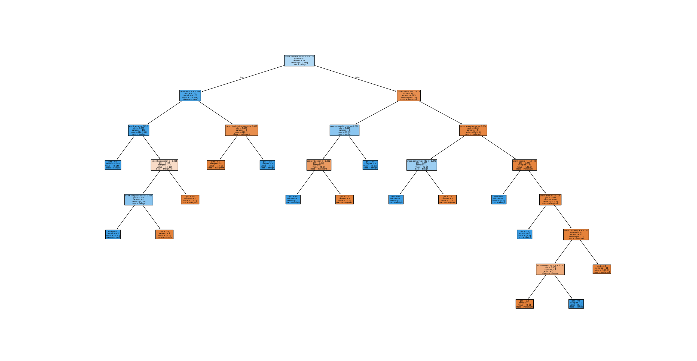

# Model Card for Predictive Maintenance on Component 7

## Model Description
This model estimates weather the given component has failed or not,
based on input data from ['Air temperature [K]', 'Process temperature [K]', 'Rotational speed [rpm]', 'Torque [Nm]']

## Development Team

| Development Information  | Text                                               |
| -------------------------|----------------------------------------------------|
| Development Team         | René Petersen                                      |
| Development Organisation | Neurospace ApS   Nydamsvej 17   8362 Hørning |
| Customer Team            | Answer is always 42                                |
| Customer Organisation    | 42 Data Stream Boulevard, Innova City, CA 90210    |
| Supporting e-mail        | support@abc.dk                                     |

## Intended Use

| Text                      | Information                                 |
|---------------------------|---------------------------------------------|
| Primarily Intended Use    | Predictive maintenance on component 7       |
| Primarily Intended Users  | Operators in control room                   |
| Out of Scope applications | Predictive maintenance on other components  |

## Model Details

| Model details | Text |
|---------------|------|
| Model Date | 10/06/2025 |
| Model Type | RandomForestClassifier |
| Model Version | 0.0.1 |
| Electricity used for training model | 5.166632127527327e-06 kWh |
| Estimated CO2 esmissions | 0.0005114965806252054 gram |
| Scheduled Retraining date | 2025/08/10 |
| Expected lifetime | 2027/10/2 |

### Model Architecture

| Parameter   | Params                                                       |
|-------------|--------------------------------------------------------------|
| n_estimator | 10               |
| max_depth   | None                  |
| min_samples_split   | 2  |
| min_samples_leaf   | 2    |
| max_features   | sqrt            |

## Training Data
The model is trained on 350 observations, and tested on 150 observations

Model is dependent on the following features:
['Air temperature [K]', 'Process temperature [K]', 'Rotational speed [rpm]', 'Torque [Nm]']

### Example input data
|   Air temperature [K] |   Process temperature [K] |   Rotational speed [rpm] |   Torque [Nm] |
|----------------------:|--------------------------:|-------------------------:|--------------:|
|                 298.1 |                     308.6 |                     1551 |          42.8 |
|                 298.2 |                     308.7 |                     1408 |          46.3 |
|                 298.1 |                     308.5 |                     1498 |          49.4 |
|                 298.2 |                     308.6 |                     1433 |          39.5 |
|                 298.2 |                     308.7 |                     1408 |          40   |
|                 298.1 |                     308.6 |                     1425 |          41.9 |
|                 298.1 |                     308.6 |                     1558 |          42.4 |
|                 298.1 |                     308.6 |                     1527 |          40.2 |
|                 298.3 |                     308.7 |                     1667 |          28.6 |
|                 298.5 |                     309   |                     1741 |          28   |

### Example output data (0 is good, 1 is failure)
|   Target |
|---------:|
|        0 |
|        0 |
|        0 |
|        0 |
|        0 |
|        0 |
|        0 |
|        0 |
|        0 |
|        0 |

## Training/Test split

| Dataset  | Number             | Percentage of dataset                                                   |
|----------|--------------------|-------------------------------------------------------------------------|
| Training | 350 | 70.00%  |
| Test     | 150  | 30.00%   |

## Number of representatives in train and test

| Dataset  | Number of normal components          | Number of failure components       |
|----------|--------------------------------------|------------------------------------|
| Training | 337  | 13 |
| Test     | 147    | 3   |

### Bias in training data

| Source       | Bias |
|--------------|------|
| Input Data   | [ ]  |
| Data Leakage | [ ]  |
| Labeling     | [ ]  |
| Test Data    | [ ]  |
| Evaluation   | [ ]  |

Bias-effect is considered Neutral, as sensor data is expected to be biased with the same amount of noise.

## Validation of model
The table below presents the accuracy of the training and test data

| Dataset | Accuracy               |
|---------|------------------------|
| Train   | 99.43% |
| Test    | 94.00%  |

Below is presented Test Confusion Matrix

|                  | True Normal        | True Failure       |
|------------------|--------------------|--------------------|
|Predicted Normal  | 138 | 0 |
|Predicted Failure | 9 | 3 |

## Metrics and Limitations

**When component 7 is under service**

**Faulty input data**

